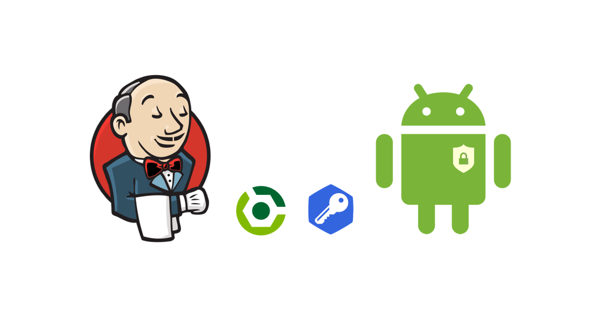
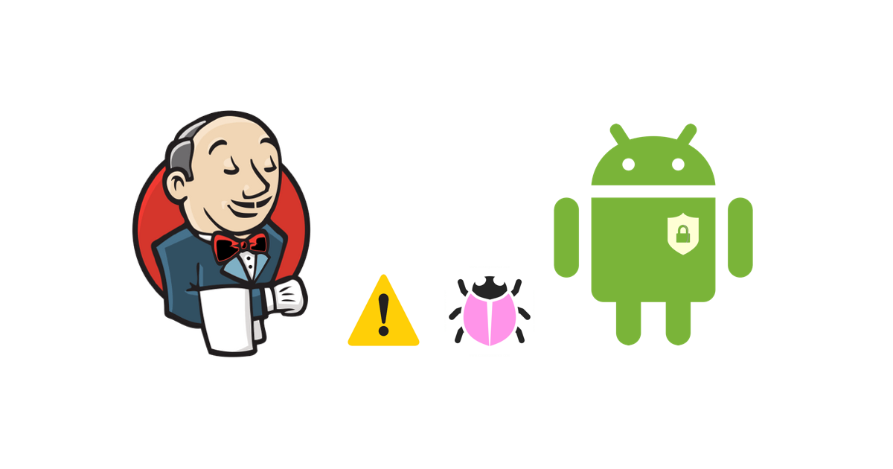

### Build Android using Jenkins

This is a sample app and tools for blog posts about full cycle of building Android from Jenkins.

### Posts

<table>
	<tr>
	    <td width="50%"></td>
	    <td width="50%"></td>
	</tr>
	<tr>
	    <td width="50%" valign="top"><a href="https://www.sromku.com/blog/build-android-jenkins"><strong>Part 1 - Setup and build Android app from Jenkins</strong></a>  Step by step guide of how to setup Jenkins and Android SDK on VM and create a basic job that builds Android apps.</td>
	    <td width="50%" valign="top"><a href="https://www.sromku.com/blog/build-android-jenkins-types"><strong>Part 2 - Build by types and sign Android app from Jenkins</strong></a>  In this part I will explain how to update Gradle file, setup sign options and build by types. Keeping sensitive keystore credential hidden.</td>
	</tr>
	<tr>
        <td width="50%"></td>
        <td width="50%"></td>
    </tr>
    <tr>
        <td width="50%" valign="top"><a href="https://www.sromku.com/blog/build-android-jenkins"><strong>Part 3 - Run lint and unit tests of Android builds from Jenkins</strong></a>  Setup and configure lint checks, build and run tests across all modules, collect and present reports on Jenkins.</td>
        <td width="50%" valign="top"><a href="#"><strong>Part 4 - Versioning, tagging and auditing Android builds</strong></a>  WIP</td>
    </tr>
    <tr>
        <td width="50%"></td>
        <td width="50%"></td>
    </tr>
    <tr>
        <td width="50%" valign="top"><a href="#"><strong>Part 5 - Must Jenkins job enhancements and plugins</strong></a>  WIP</td>
        <td width="50%" valign="top"><a href="#"><strong>Part 6 - Notifying on Slack, uploading artifacts to cloud storage</strong></a>  WIP</td>
    </tr>
    <tr>
        <td width="50%"></td>
        <td width="50%"></td>
    </tr>
    <tr>
        <td width="50%" valign="top"><a href="#"><strong>Part 7 - Build and run UI Automation tests on multiple devices</strong></a>  WIP</td>
        <td width="50%" valign="top"><a href="#"><strong>Part 8 - Setup and run `Infer` static analysis</strong></a>  WIP</td>
    </tr>
</table>

### WIP

Parts 1-3 are ready.
Parts 4-8 are in progress.

### Author

Roman Kushnarenko - [sromku](https://github.com/sromku)

### RSS

